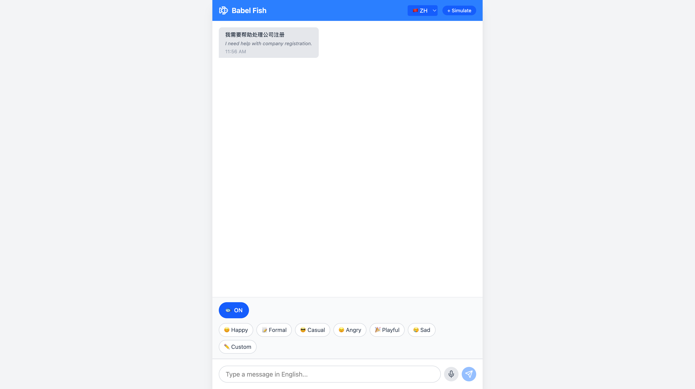
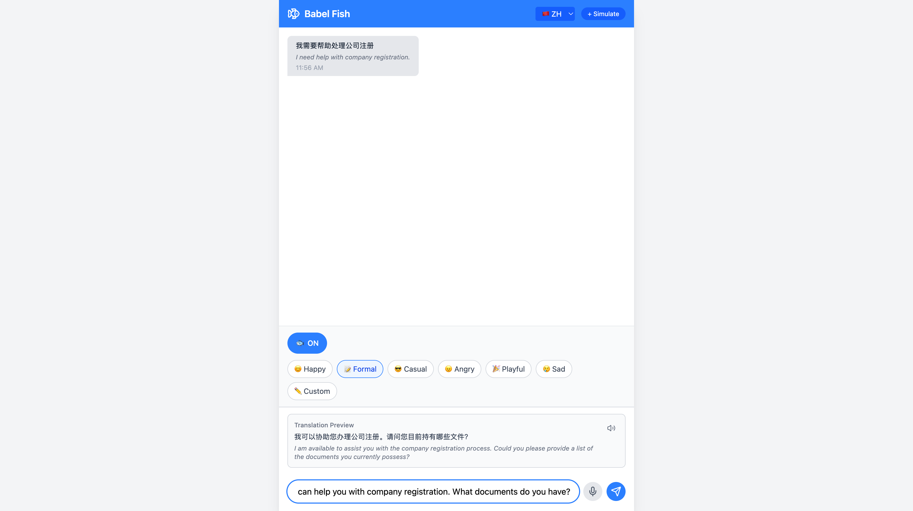
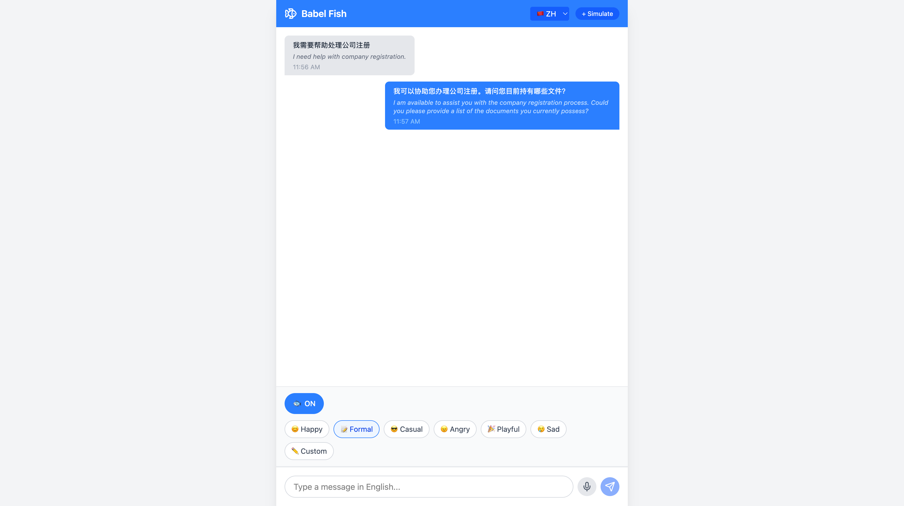

# Babel Fish

> "The Babel fish is small, yellow, leech-like, and probably the oddest thing in the Universe."
> — *The Hitchhiker's Guide to the Galaxy*

A real-time translation chat application that helps English-speaking agents communicate with clients in different languages. Built for OSOME Build Day 2026.


## Features

### Real-Time Translation
- Fish toggle to enable/disable translation mode
- Bidirectional translation (Chinese ↔ English and more)
- Translation preview before sending
- Batch translation for existing messages
- Supported languages: Chinese, Thai, Vietnamese, Japanese, Korean, Hungarian, Russian, Tagalog

### Tone Modifiers
- Preset tones: Happy, Formal, Casual, Angry, Playful, Sad
- Custom tone input with prompt injection protection
- Real-time preview with tone applied

### Speech-to-Text (STT)
- Voice input via microphone
- Whisper transcription (local)
- Auto language detection
- LLM cleanup for filler words and grammar

### Text-to-Speech (TTS)
- Audio playback for translated messages
- Bilingual voices (English & Chinese)
- Local processing via Docker

## Screenshots

### Empty State


### Translation with Fish Toggle ON


### Tone Selection & Preview


### Full Conversation


## Tech Stack

| Layer | Technology |
|-------|------------|
| Framework | React 19 + Vite + TypeScript |
| Styling | Tailwind CSS v4 |
| LLM | LM Studio (GPT-OSS 20B) |
| STT | Whisper (via Docker) |
| TTS | Piper (via LocalAI Docker) |
| Storage | localStorage |

## Prerequisites

- Node.js 20+
- LM Studio running on port 1234
- Docker (for STT/TTS features)

## Getting Started

```bash
# Install dependencies
npm install

# Start development server
npm run dev
```

Open [http://localhost:5173](http://localhost:5173)

> **Tip:** Clear localStorage in browser DevTools (Application > Local Storage) for a fresh start.

## Scripts

| Command | Description |
|---------|-------------|
| `npm run dev` | Start development server |
| `npm run build` | Build for production |
| `npm run preview` | Preview production build |
| `npm run lint` | Run ESLint |

## Project Structure

```
babel-fish/
├── src/
│   ├── components/
│   │   └── Chat/           # ChatContainer, MessageList, MessageBubble, etc.
│   ├── services/
│   │   ├── llm.ts          # LM Studio integration
│   │   ├── stt.ts          # Speech-to-text service
│   │   └── tts.ts          # Text-to-speech service
│   ├── hooks/
│   │   ├── useChat.ts      # Chat state management
│   │   ├── useVoiceRecorder.ts
│   │   ├── useTTS.ts
│   │   └── useLocalStorage.ts
│   └── types/
└── docs/                   # Screenshots
```

## Related Links

- [Notion TRD](https://www.notion.so/osome/Babel-30294fd5a8ec809ca09dc1b71c2dd33b)
- [Jira Epic: OLS-131](https://reallyosome.atlassian.net/browse/OLS-131)

## License

Private - OSOME Build Day 2026
